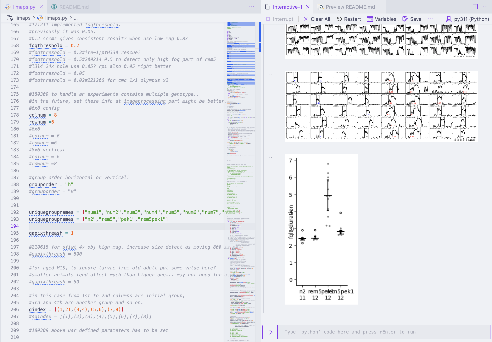
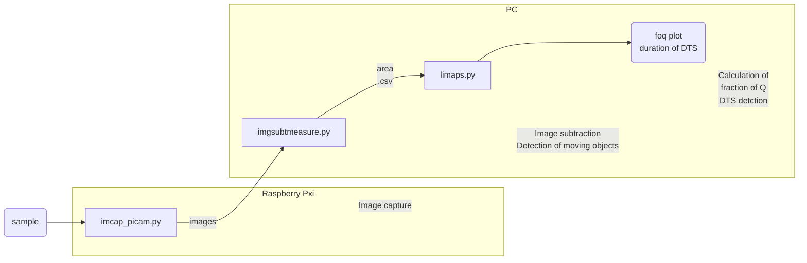
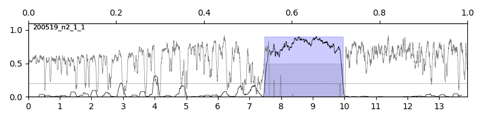
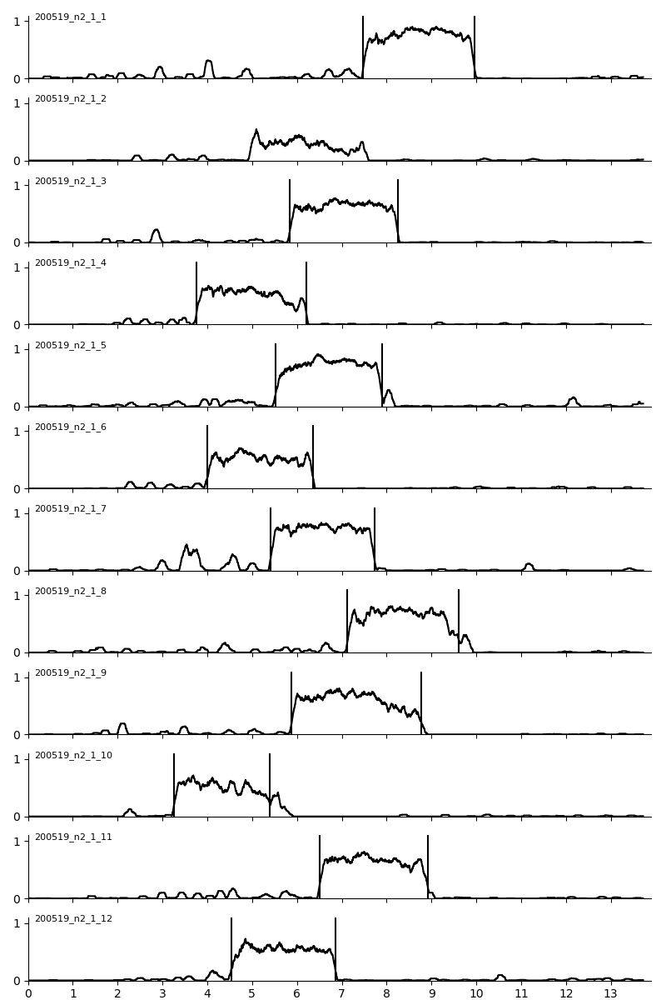
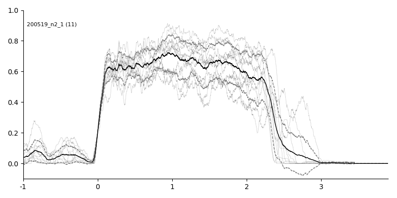
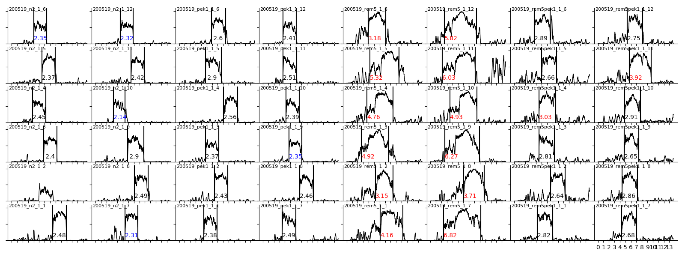
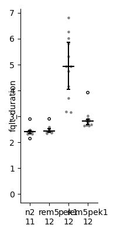

# limaps




## Overview




This script was written for motion data analysis step of the Rapid C. elegans motion imaging (Remi) system.

It calculate fraction of quiescence of the data produced by  [`imagesubtandmeasure.py`](https://github.com/t3kawano/imagesubtract_measure) and detect lethargus/developmentally timed sleep (DTS) period of each roi.


Images obtained by [`imcap_picam.py`](https://github.com/t3kawano/imagecapture_picam) , and processed by [`imagesubtandmeasure.py`](https://github.com/t3kawano/imagesubtract_measure) are suitable input for this script.

## Requirement
- python3
- pandas
- numpy
- [`dotplot.py`](https://github.com/t3kawano/tkmodules/blob/1555f4af8eaff04b8e12ed82767d5f3547255a44/dotplot.py)

## Installation
Setup python3 environment.

Put the `limaps.py` into somewhere on your computer.

if you want to see dotplot, get [`dotplot.py`](https://github.com/t3kawano/tkmodules/blob/1555f4af8eaff04b8e12ed82767d5f3547255a44/dotplot.py)  and put it into same folder with `limpas.py`
 


## Usage

1. Name the .csv file made by `imagesubtandmeasure` and containing area data of each roi as following format; date_experiment name_1_image interval(sec).csv`

    eg. `200519_rem5pek1_1_2.csv`
    
    Make a new folder for the experiment, and put the .csv file into the folder.


2. Open `limaps.py` file and assign values to following variables.

- column and row numbers

    Specify column and row numbers of your sample.

    ```python
    #6x8 config
    colnum = 8
    rownum =6
    ```

- group order direction

    If the groups described below are ordered in left to right direction, set as "h"

    ```python
    #group order horizontal or vertical?
    grouporder = "h"
    #grouporder = "v"
    ```

- group names

    Put names of your samples in a string list.

    ```python
    uniquegroupnames = ["n2","your_gene_name","strain_name","etc",]
    ```

- group setting

    Set how groups are loaded in the PDMS chip. Write First and last column number of each group in a parenthesis.

    ```python
    #in this case from 1st to 3rd columns are initial group, 
    #4th are another group and so on.
    gindex = [(1,3),(4),(5,6),(7,8)]

    #Below means every column are different group
    sgindex = [(1),(2),(3),(4),(5),(6),(7),(8)]
    ```

3. Once everything are assigned, Run the `limaps.py`. 

4. File chooser dialog will appears. Select the .csv file made by `imagesubtandmeasure` and named as described in the step 1, and wait for a while.

The script will process the data and put several files in the same folder where the input .csv file exist.


## Output
Following are descriptions about some output files.

- date_groupname_experimentnumber_samplenumber_foq.png

    Each sample's fractoin of q. gray line is area of moving object, black line is fraction of q. blue shaded area is lethargus detected by the script.
    
    

- date_groupname_experimentnumber_samplenumber_foq.csv

    CSV data of each sample's fractoin of q. each row contains each frame.

- date_groupname_experimentnumber_summary.csv

    Table of measurements.

    fqlt_start: start point of lethargus
    
    fqlt_end: end point of lethargus
    
    fqlt_duration: duration (hrs) of lethargus
    
    totalq: total quiescence during lethargus(min)
    
    meanquiescent: quiescent time/lethargus duration (totalq/fqlt_duration/60)
    
    meanquiescentout: quiescent time/non-lethargus time
    
    numberofbout: quiescent number during lethargus
    
    qmean: mean duration of quiescent bout (sec)
    
    amean: mean duration of active bout(sec)
    
    qmedian: median duration of quiescent bout (frame)
    
    amedian: median duration of active bout (frame)
    
    qfreq: numberofbout/fqlt_duration (number/hr)

- date_groupname_experimentnumber_foqfull_.png

    A foq graph contains foq of a sample group.

    
    
- date_groupname_experimentnumber_fqaligned_lethargus.png

    foq aligned at beginning of lethargus
    
    dotted lines: each sample
    
    black line: mean
    
    dashed line: mean +- sd


    
    
- date_groupname_experimentnumber_fqalignedtail_lethargus.png

    foq aligned at end of lethargus

- date_groupname_experimentnumber__fqlt_df.csv

    foq table during lethargus +- 1hr

- date_experimentname_experimentnumber_gridfoqwithflag_meancalc_.png

    grid graph of fraction of q and duration of lethargus. each panel correspond to each well of PDMS chip.

    

- dotplot

    Lethargus duration dotplot of each group.

    
        


- .pkl file

    .pkl file containing data made by the script. You may use it for further analysis.


As mentioned above, the script sometimes fails lethargus detection,
so these files may contains incorrect data.
You have to eliminate the incorrect data for publication quality analysis.    


<!-- 
## Note
## Features 
## Author -->

## Reference
Kawano, Taizo et al. “ER proteostasis regulators cell-non-autonomously control sleep.” Cell reports vol. 42,3 (2023): 112267. https://doi.org/10.1016/j.celrep.2023.112267

## License
MPL-2.0
